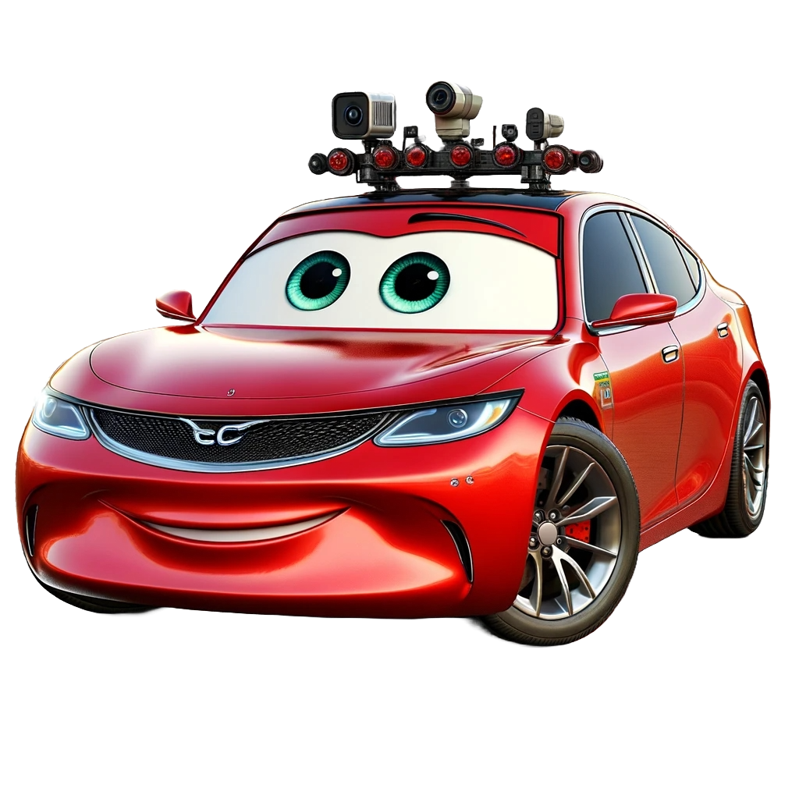

# 🚘 Self-Driving Car

  

Self-driving cars have been one of the most challenging and fascinating fields of study in automation. The main motive behind such a concept is to provide effortless and comfortable driving. The evolution of this discipline has pushed many researchers and enthusiasts to build automobiles that achieve level five autonomy. This repository aims to implement a simulated car with level four autonomy. Inspired by the timeline of self-driving cars and ever-growing technologies, the work has adopted the Carla simulator as a base for formulating the problem statement. It is open-source and offers various functionalities one can think about in relation to self-driving cars (SDC). This repository branches out to address concepts of visual perception, state estimation and localization, and motion planning. A previous version of this project can be found [here](https://drive.google.com/file/d/1IXyGhBM2OLqZS4HTRtfFpyoeYW-f11aI/view?usp=share\_link). This version is part of a continuous development effort. 

### Documentation
For more informaiton on this project, please refer the following [GitBook](https://sdc-docs.kamath.work)