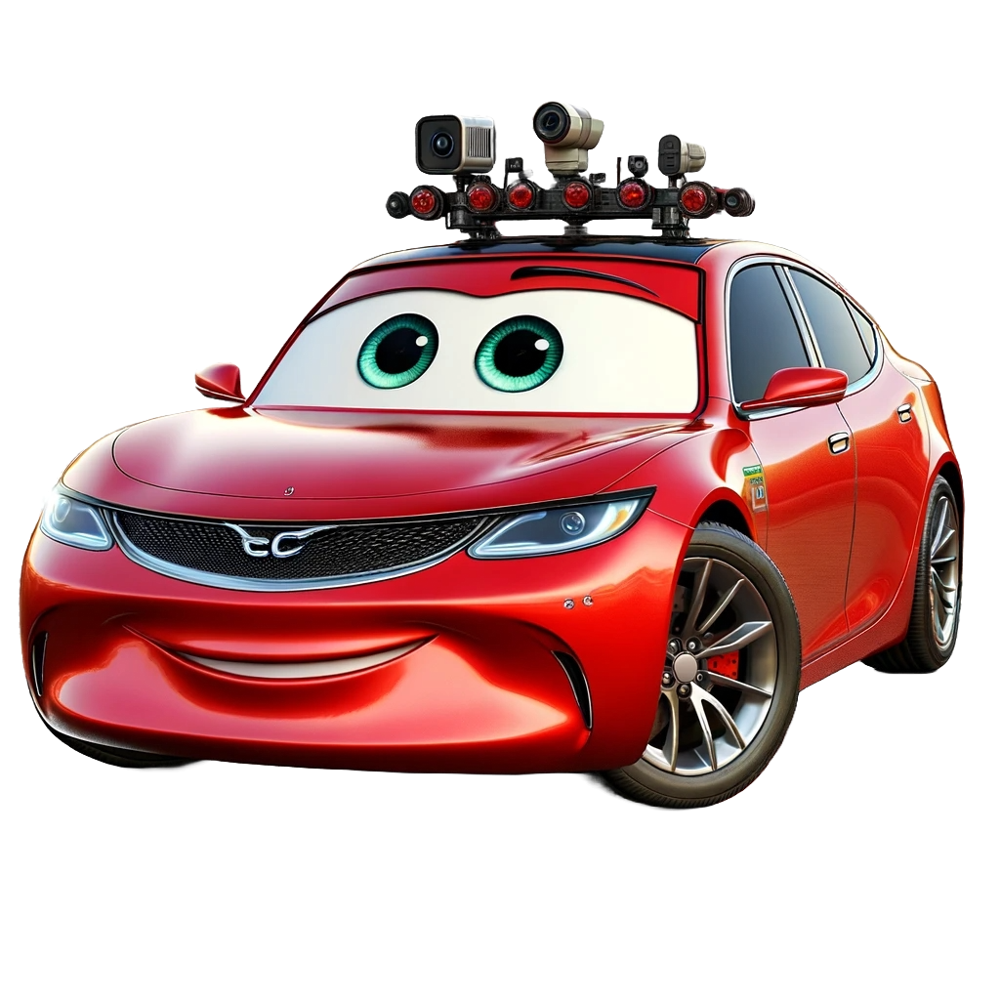

# Self-Driving Car 🚗

<p align="center">
  
</p>

Self-driving cars have been one of the most challenging and fascinating fields of study in automation. The main motive behind such a concept is to provide effortless and comfortable driving. The evolution of this discipline has pushed many researchers and enthusiasts to build automobiles that achieve level five autonomy. This repository aims to implement a simulated car with level four autonomy. Inspired by the timeline of self-driving cars and ever-growing technologies, the work has adopted the Carla simulator as a base for formulating the problem statement. It is open-source and offers various functionalities one can think about in relation to self-driving cars (SDC). This repository branches out to address concepts of visual perception, state estimation and localization, and motion planning. A previous version of this project can be found [here](https://drive.google.com/file/d/1IXyGhBM2OLqZS4HTRtfFpyoeYW-f11aI/view?usp=share_link). This version is part of a continuous development effort.

## Objective 🎯
Design a Level 4 Autonomous Vehicle and serve as a platform for another project **SimPan**. **SimPan** would be designed to serve as an annotation tool (labeling, segmentation, event manipulation, etc), scenario augmentation, language guided modeling with analytical plugins. 

## Prerequisites 📜
Refer to the [Carla simulator document](https://carla.readthedocs.io/en/stable/) to get to know about the Carla simulator. Install [docker](https://docs.docker.com) and have it running. Once you are done with this, you may clone this repository. Follow the **Setup** section to have the Carla simulator up and running.

## Setup 🛠️
* Install Nvidia drivers.
* For this project, we will have the Carla server up via the docker. To run Carla on docker, refer [this](https://carla.readthedocs.io/en/latest/build_docker/) doc. Remember to install Nvidia container toolkit.
```
docker pull carlasim/carla:<tag>      # eg: carlasim/carla:0.9.15 

docker run --rm -it -d --privileged --gpus all --net=host --name carla-server carlasim/carla:<tag> /bin/bash ./CarlaUE4.sh -RenderOffScreen
```
* Alternatively, if you want to have the server up with rendering enabled, you may follow these steps:
```
xhost +local:docker      # Allow docker containers to display on the host's X server

docker run --rm -it -d --privileged --gpus all --net=host --name carla-server -e DISPLAY=$DISPLAY -v /tmp/.X11-unix:/tmp/.X11-unix carlasim/carla:<tag> /bin/bash ./CarlaUE4.sh
```
* Create and activate an environment. Note that this project is using `Python 3.8`. Install requirements using pip from the requirements file found in `./SDC` folder:
```
pip install -r requirements.txt
```
* If you running the container with rendering enabled - remember to revert the permissions you set with xhost for security reasons once you're done - `xhost -local:docker`.
* Note that if you want to run the python client (getting pygame window up in Mac) from your Mac, then you have to setup X11 Forwarding. Do the follwing for setting this up:
    * Download and install XQuartz from [here](https://www.xquartz.org/).
    * After installation, log out and log back in to ensure XQuartz starts properly.
    * Upon opening the XQuartz terimal, run `ssh -Y username@remote-server` for secure connection. You may then simply run your script.
    * The downside is that the visualization and communication will have a noticable latency.

## Folder Structure 🧱
```
SDC Repo.

|- data (any data, structured/unstructured, goes here)
    |- assets (any static and long-lived objects goes here - will be public)
    |- config (all the generated/custom configurations for the actors in the environment must be defeined here)
    |- raw (holds unprocessed information)
    |- processed (holds processed information)
|- logs (logging of information will be done here; logging must be in the following format `log_<timestamp>.<extension>`)
|- src (driving code goes)
    |- base (holds the definition of handlers like actors, ego vehivles, maps, etc)
    |- model (contains pydantic and enums models that define attributes for the enviroment)
    |- uitls (untilities are defined here)
    |- client.py (establistes the Carla client and acts as a gateway between our custom scripts and the Carla server)
    |- data_synthesizer.py (script for generating and storing any kind of data from any actor's point of view)
|- test (All test cases are defined here)
|- main.py (contains the driver code)
|- requirements.txt (holds dependencies)
```

## Tasks 📋
- [ ] Define handlers to spawn/activate/configure entities
    - [X] Vehicles
    - [X] Pedestrians
    - [ ] Maps
    - [ ] Weather and time
- [ ] Data acquisition
    - [X] Spawn random actors - vehicles, pedestrians and sensors
    - [ ] Spawn props in the environment
    - [ ] Capture snapshots from various onboard sensors for a given actor/player (if applicable)
        - [ ] RGB Camer
        - [ ] Depth Camera
        - [ ] LIDAR
        - [ ] GPS
        - [ ] IMU
        - [ ] RADAR
        - [ ] SONAR
- [ ] High level motion planning
- [ ] State estimation and localization
- [ ] Build perception stack
- [ ] Low level motion planning

## How do I run the Carla client? 🏃🏻‍♂️
The codebase is designed such that all commands needed for the execution of the client resides in `main.py` - aka the driver module. We establish the Carla client as a CLI application using which they can perform tasks such as data annotaion, automation, basically any ascpect of the self-driving car.

#### How to generate configurations for actors ought to be spawned in the Carla environment?
* Make sure you have a base configuration for any actor defined in the designated directory. In our case, you can find `vehicle0.yaml` and `pedestrian0.yaml` in `./data/config/vehicles/` and `./data/config/pedestrians/` respectively - Experiment 0 :D.
* To get to know our configuration CLI command, run:
```
python -m main generate_configuration --help 
```
* To generate configurations for vehicles, you have to run (defaults to vehicle):
```
python -m main generate_vehicle_configuration
```
* To generate configurations for pedestrians, run:
```
python -m main generate_configuration --config-dir=<CONFIG_DIR> \
                                      --reference-config-file=<REFERENCE_YAML_FILE> \
                                      --for-pedestrian --no-for-vehicle 
```

#### How to perform data acquisition in the Carla environment?
* To get to know our data acquisition CLI command, run:
```
python -m main generate_synthetic_data --help
```
* You may set the command's arguments/options as per you need and run the command.
```
python -m main generate_synthetic_data [OPTIONS] 
```

## Notes 📝
* As much as possible, try to stick to this template. Any improvement/suggestion to this organization is always welcome.
* Let us try to write a clean code. Comment where ever necessary so that others can understand and pickup easily.
Jupyter notebooks must contain minimal code. What it means is, if you have a big function, the implementation falls into the appropriate src folder and this funciton gets called in the notebook. This stands for classes as well.
* If there is anything that you feel is important, please mention them under the appropriate Tasks subheadings.
* Any tasks that you take, see to it that you are not in the main/master branch. Checkout the main/master branch and start from there. Once done, create a pull request.
* To maintain consistency, the naming of all branches except main/master must be done as follows: `<property>/<branch-name>`. The property represents, the type of commit - it may be addition of features, bug fixes, etc. For example, if you are adding a new camera model to the player, the branch name would be `[feature]/addition-of-camera-module`.

## Environment Variables 🤫
```
export HOSTNAME="localhost"
export PORT="2000"
```

## References 🔗
* [Carla Simulator](https://carla.org)
* [Carla Simulator - Sensors reference](https://carla.readthedocs.io/en/latest/ref_sensors/)
* [Carla Simulator - Blueprint Library](https://carla.readthedocs.io/en/latest/bp_library/)